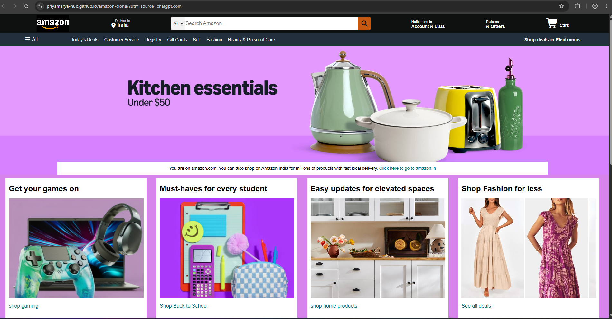
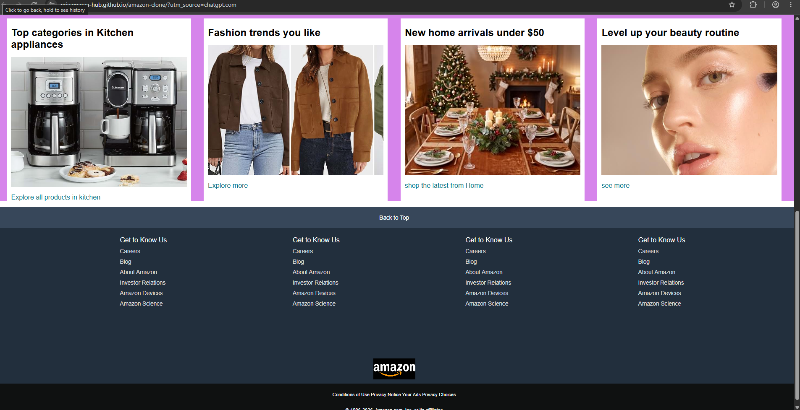

# 🛒 Amazon Clone

A responsive **Amazon homepage clone** built using **HTML and CSS**.
This project recreates the main layout and visual design of Amazon's website for practice and learning purposes.

## 🚀 Live Demo

🔗 **Live Website:** https://priyamarya-hub.github.io/amazon-clone/

## 📸 Screenshots

### Homepage



### Full Page



## 📂 Project Overview

This project includes a recreation of the major sections of the Amazon homepage:

* 🏠 Amazon-style navigation bar
* 📍 Delivery location section
* 🔎 Search bar
* 👤 Sign in / Account & Lists
* 📦 Returns & Orders
* 🛒 Shopping cart
* 📋 Navigation panel
* 🖼️ Hero/banner section
* 🛍️ Product/category cards
* 🔗 Footer section
* 📱 Basic responsive layout structure

## 🛠️ Technologies Used

* **HTML5** — Used to create the structure of the webpage
* **CSS3** — Used for styling, layout, colors, spacing, and design
* **Font Awesome** — Used for icons

## 📁 Project Structure

```text
amazon-clone/
│
├── index.html
├── style.css
│
├── amazon_logo.png
├── hero_image.jpg
├── box1_image.jpg
├── box2_image.jpg
├── box3_image.jpg
├── box4_image.jpg
├── box5_image.jpg
├── box6_image.jpg
├── box7_image.jpg
└── box8_image.jpg
```

## ✨ Features

* Amazon-inspired navigation bar
* Search bar UI
* Product/category sections
* Hover effects on navigation elements
* Amazon-style footer
* Hero section with banner image
* Clean HTML and CSS structure

## 🎯 Purpose

This project was created to practice and improve my **HTML and CSS skills** by recreating a real-world website layout.

## 🔮 Future Improvements

I plan to add JavaScript functionality in the future, including:

* 🔎 Functional product search
* 🛒 Add-to-cart functionality
* ❤️ Wishlist
* 🔐 Login/sign-in functionality
* 💾 Local storage
* 📱 Improved mobile responsiveness

## 👨‍💻 Author

**Priyam Arya**

GitHub: https://github.com/priyamarya-hub

---

> ⚠️ **Disclaimer:** This is a personal educational project inspired by the Amazon website. It is not affiliated with or endorsed by Amazon.
